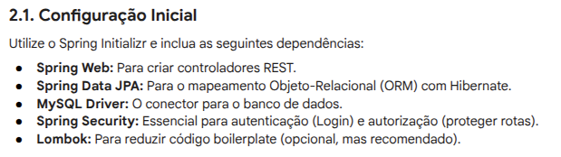

# __*jeffrey*__ - Rede Social Full Stack. :star_struck:

Este documento apresenta o plano de desenvolvimento passo a passo para construir uma rede social escalável, utilizando as seguintes tecnologias:

* Backend: Java 21+ com Spring Boot 3.
* Frontend: JavaScript com React (usando Vite).
* Banco de Dados: MySQL.

Será um projeto pessoal para praticar e testar abilidades. :monocle_face:  
Use o arquivo [jeffrey](logica-de-desenvolvimento/Jeffrey.pdf) como exemplo da logica de desenvolvimento do site.
---

## Fases do desenvolvimento: :nerd_face:

1. Fase de Planejamento e Arquitetura.
   1. [ ] Modelagem de Dados (MySQL).
   2. [ ] Arquitetura da Solução.
      1. [ ] Frontend (React): Interface do usuário que envia requisições HTTP (GET, POST, PUT, DELETE).
      2. [ ] backend (Spring Boot): Recebe as requisições, executa a lógica de negócio (Services), interage com o Banco de Dados (Repositories) e retorna respostas JSON.
      3. [ ] Banco de Dados (MySQL): Armazenamento persistente de todos os dados.
2. Backend: Java com Spring Boot (Utiliza-se o Spring Initializr e inclue as seguintes dependencias: .
   1. [x] Configuração Inicial.
   2. [ ] Autenticação (Spring Security e JWT).
   3. [ ] Estrutura de Camadas.
3. Banco de Dados: MySQL.
   1. [ ] Preparação.
   2. [ ] Otimização.
4. Frontend: JavaScript com React.
   1. [x] Configuração do Projeto.
   2. [ ] Fluxo de Desenvolvimento da Interface.
   3. [ ] Implementação do Feed.
5. Próximos Passos e Desafios.
